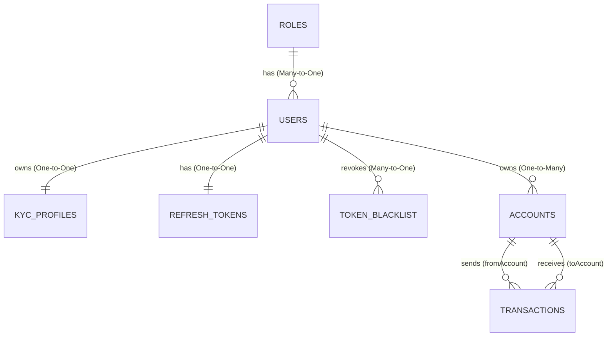

# TÀI LIỆU GIẢI THÍCH MỐI QUAN HỆ GIỮA CÁC THỰC THỂ (ENTITY RELATIONSHIPS)
## HỆ THỐNG NGÂN HÀNG RIKKEI BANK

Tài liệu này giải thích chi tiết cấu trúc liên kết và các mối quan hệ (JPA Relationships) giữa 7 thực thể (Entity) cốt lõi trong dự án Backend. Việc hiểu rõ các mối quan hệ này sẽ giúp em tự tin bảo vệ dự án trước hội đồng đánh giá và hiểu sâu sắc cách luồng dữ liệu vận hành.

---

## 1. Sơ đồ thực thể quan hệ (ERD - Mermaid Diagram)

Dưới đây là sơ đồ trực quan hóa cách các thực thể liên kết với nhau trong Cơ sở dữ liệu:



---

## 2. Chi tiết từng mối quan hệ

### 2.1. Quan hệ giữa User và Role (Nhiều - Một / Many-to-One)
*   **Mô tả nghiệp vụ:** Một vai trò (ví dụ: `ROLE_CUSTOMER`, `ROLE_STAFF`, `ROLE_ADMIN`) có thể được gán cho nhiều người dùng khác nhau. Tuy nhiên, tại một thời điểm, một người dùng chỉ thuộc về duy nhất **một** vai trò.
*   **Kỹ thuật mapping trong Java (`User.java`):**
    ```java
    @ManyToOne
    @JoinColumn(name = "role_id", nullable = false)
    private Role role;
    ```
    *   `@ManyToOne`: Cho Hibernate biết đây là quan hệ Nhiều-Một.
    *   `@JoinColumn(name = "role_id")`: Tạo một khóa ngoại tên là `role_id` ở bảng `users` liên kết tới khóa chính `id` của bảng `roles`.

---

### 2.2. Quan hệ giữa User và KycProfile (Một - Một / One-to-One)
*   **Mô tả nghiệp vụ:** Để đảm bảo tính bảo mật pháp lý, mỗi khách hàng chỉ có duy nhất **một** hồ sơ định danh cá nhân (eKYC). Ngược lại, một hồ sơ eKYC cũng chỉ được xác thực cho duy nhất **một** tài khoản người dùng.
*   **Kỹ thuật mapping trong Java (`KycProfile.java`):**
    ```java
    @OneToOne
    @JoinColumn(name = "user_id", nullable = false, unique = true)
    private User user;
    ```
    *   `@OneToOne`: Khai báo quan hệ Một-Một.
    *   `unique = true` ở `@JoinColumn`: Đảm bảo tính duy nhất ở mức database (không bao giờ có chuyện 2 hồ sơ KYC trùng 1 `user_id`).

---

### 2.3. Quan hệ giữa User và RefreshToken (Một - Một / One-to-One)
*   **Mô tả nghiệp vụ:** Mỗi phiên đăng nhập của một người dùng cụ thể sẽ duy trì duy nhất **một** RefreshToken để xoay vòng lấy AccessToken mới.
*   **Kỹ thuật mapping trong Java (`RefreshToken.java`):**
    ```java
    @OneToOne
    @JoinColumn(name = "user_id", nullable = false, unique = true)
    private User user;
    ```
*   **Lý do cải tiến (Kiến trúc chuẩn):** 
    Thay vì liên kết với `KycProfile` như sơ đồ sơ khai, thầy trò mình đã liên kết trực tiếp với `User`. Điều này giúp hệ thống hoạt động thống nhất cho cả tài khoản của nhân viên ngân hàng (`Staff`) hay quản trị viên (`Admin`) vì các tài khoản này đăng nhập vào hệ thống nhưng không cần thực hiện quy trình eKYC (không có `kyc_profile`).

---

### 2.4. Quan hệ giữa User và TokenBlackList (Nhiều - Một / Many-to-One)
*   **Mô tả nghiệp vụ:** Khi người dùng bấm Đăng xuất (Logout), AccessToken hiện tại của họ bị thu hồi và đưa vào danh sách đen. Một người dùng có thể thực hiện đăng xuất nhiều lần ở các thiết bị/phiên khác nhau, nên một User có thể liên kết với nhiều token trong Blacklist.
*   **Kỹ thuật mapping trong Java (`TokenBlackList.java`):**
    ```java
    @ManyToOne
    @JoinColumn(name = "user_id")
    private User user;
    ```

---

### 2.5. Quan hệ giữa User và Account (Một - Nhiều / One-to-Many)
*   **Mô tả nghiệp vụ:** Một khách hàng (User) khi mở tài khoản tại Rikkei Bank có thể sở hữu **nhiều tài khoản thanh toán** khác nhau (ví dụ: Tài khoản thanh toán thường, Tài khoản tiết kiệm, Tài khoản số đẹp...). Tuy nhiên, một tài khoản cụ thể bắt buộc phải thuộc về một chủ sở hữu duy nhất.
*   **Kỹ thuật mapping trong Java (`Account.java`):**
    ```java
    @ManyToOne
    @JoinColumn(name = "user_id", nullable = false)
    private User user;
    ```
    *   Đây là đầu Nhiều (Many) của quan hệ Một-Nhiều từ User -> Account. Bảng `accounts` sẽ có cột khóa ngoại `user_id`.

---

### 2.6. Quan hệ đặc biệt: Giao dịch chuyển tiền (Double Many-to-One)
Đây là phần nghiệp vụ tài chính cốt lõi và phức tạp nhất trong database.
*   **Mô tả nghiệp vụ:** Một giao dịch chuyển khoản luôn liên quan đến **hai tài khoản khác nhau**:
    1.  Tài khoản nguồn (Bên gửi tiền / `fromAccount`)
    2.  Tài khoản đích (Bên nhận tiền / `toAccount`)
*   **Kỹ thuật mapping trong Java (`Transaction.java`):**
    ```java
    // Tài khoản gửi tiền (fromAccount)
    @ManyToOne
    @JoinColumn(name = "from_account_id", nullable = false)
    private Account fromAccount;

    // Tài khoản nhận tiền (toAccount)
    @ManyToOne
    @JoinColumn(name = "to_account_id", nullable = false)
    private Account toAccount;
    ```
*   **Giải thích chi tiết:**
    *   Bảng `transactions` sẽ chứa **hai khóa ngoại** cùng tham chiếu tới bảng `accounts` là `from_account_id` và `to_account_id`.
    *   Kiến trúc này giúp chúng ta dễ dàng truy vấn lịch sử giao dịch (sao kê) bằng phép toán logic `OR` (quét tất cả các giao dịch mà tài khoản đó đóng vai trò là tài khoản gửi tiền **hoặc** tài khoản nhận tiền).

---

## 3. Các Annotation bổ trợ quan trọng cần nhớ

1.  `@PrePersist`: Chạy tự động trước khi bản ghi được thêm mới (`INSERT`) vào database. Thầy trò mình dùng để tự sinh thời gian tạo (`createdAt = LocalDateTime.now()`) và gán các trạng thái mặc định như `isKyc = false`, `status = Status.PENDING`, tránh việc phải gán thủ công bằng tay.
2.  `@PreUpdate`: Chạy tự động trước khi bản ghi được cập nhật (`UPDATE`) vào database. Thường dùng để cập nhật lại thời gian sửa đổi (`updatedAt = LocalDateTime.now()`).
3.  `@Enumerated(EnumType.STRING)`: Mặc định Hibernate sẽ lưu Enum dưới dạng số index (0, 1, 2). Cấu hình này giúp lưu trực tiếp dạng chữ (`PENDING`, `CONFIRM`, `REJECT`) xuống MySQL giúp dễ đọc dữ liệu khi xem bằng mắt thường.
